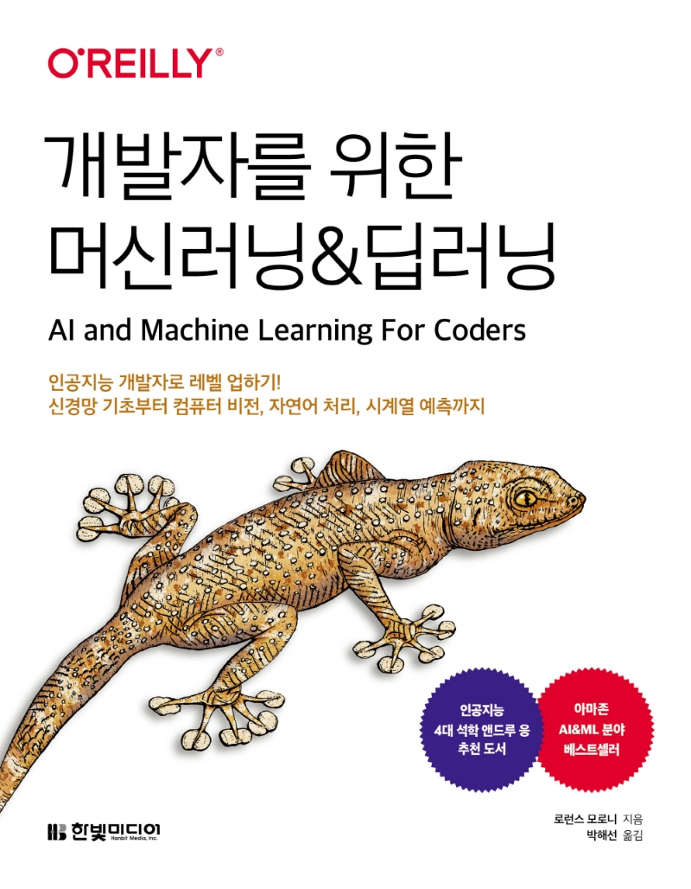

# 개발자를 위한 머신러닝&amp;딥러닝

이 저장소는 <[개발자를 위한 머신러닝&딥러닝](https://bit.ly/aiml-book)> 책의 주피터 노트북을 담고 있습니다. 이 책은 코세라(Cousera)에서 많은 딥러닝 강좌를 진행하고 있는 구글의 수석 AI 애드보커트인 로런스 모로니(Laurence Moroney)가 쓴 <AI and Machine Learning For Corders>의 번역서입니다!

특별히 개발자를 염두해 두고 어려운 수식이나 이론을 가급적 피하고 쉬운 설명과 비유를 통해서 직관적으로 신경망을 이해하도록 돕고 있습니다. 실감나는 예제를 사용해 합성곱 신경망, 순환 신경망은 물론 텐서플로 라이트(TensorFlow Lite)와 TensorFlow.js까지 폭 넓은 주제를 아우릅니다. 딥러닝으로 어떤 일을 할 수 있는지 알아 볼 수 있고, 텐서플로와 케라스를 구체적으로 실습해 볼 수 있습니다.
